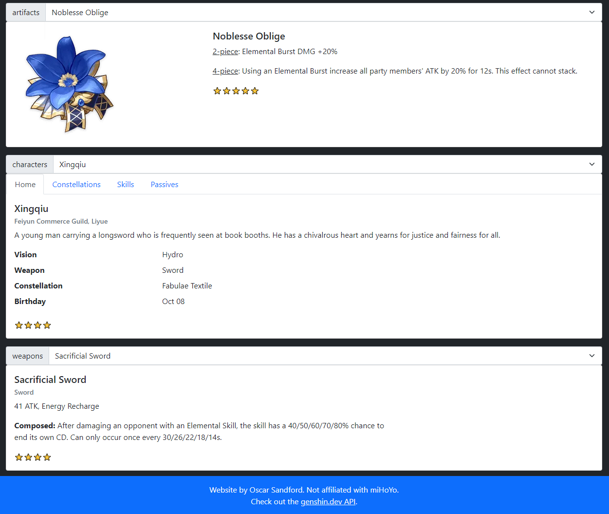

# Genshinpedia

A web user interface made with React for accessing the [genshin.dev API](https://github.com/genshindev/api). 

<p align="center">
  
</p>
<hr><br>

## Setup

With this repository as your working directory, install its dependencies with
```sh
npm ci
```
and run the development build on `localhost:3000` with
```sh
npm start
```

## Deploy 
```sh
npm run deploy
```
